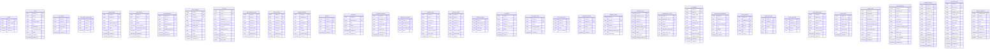

# DB ER図

```mermaid
erDiagram
  tenants {
    string tenant_id PK
    string tenant_name
    string status
    timestamp created_at
    timestamp updated_at
  }
  users {
    string tenant_id PK
    string user_id PK
    string email
    string display_name
    string role
    string department
    string employment_type
    string status
    timestamp created_at
    timestamp updated_at
  }
  user_groups {
    string tenant_id PK
    string group_id PK
    string group_name
    string group_type
    string status
    timestamp created_at
  }
  user_group_memberships {
    string tenant_id PK
    string user_id PK
    string group_id PK
    string source
    timestamp created_at
  }
  web_sessions {
    string tenant_id PK
    string session_id PK
    string user_id
    string refresh_token_ref
    string csrf_secret_hash
    string status
    timestamp expires_at
    timestamp created_at
    timestamp updated_at
  }
  chat_sessions {
    string tenant_id PK
    uuid chat_id PK
    string title
    string status
    timestamp last_message_at
    string created_by_user_id
    timestamp created_at
    timestamp updated_at
    timestamp deleted_at
  }
  chat_participants {
    string tenant_id PK
    uuid chat_id PK
    string user_id PK
    string participant_role
    string status
    string added_by_user_id
    timestamp added_at
    timestamp removed_at
  }
  chat_messages {
    string tenant_id PK
    uuid chat_id PK
    uuid message_id PK
    uuid parent_message_id
    string sender_user_id
    string sender_type
    text content_text
    uuid run_id
    string status
    timestamp created_at
    timestamp completed_at
  }
  chat_runs {
    string tenant_id PK
    uuid run_id PK
    uuid chat_id
    uuid message_id
    string requested_by_user_id
    json retrieval_policy_json
    string model_id
    string prompt_version
    string status
    timestamp started_at
    timestamp completed_at
    string error_code
  }
  chat_message_events {
    string tenant_id PK
    uuid chat_id PK
    uuid message_id PK
    bigint event_seq PK
    uuid event_id
    string event_name
    string event_type
    json payload_json
    timestamp created_at
  }
  citation_records {
    string tenant_id PK
    uuid chat_id PK
    uuid message_id PK
    string citation_id PK
    string document_id
    string version_id
    string chunk_id
    json display_json
    timestamp created_at
  }
  message_feedback {
    string tenant_id PK
    uuid feedback_id
    uuid chat_id PK
    uuid message_id PK
    string user_id PK
    string rating
    text comment
    string problem_type
    timestamp created_at
  }
  favorites {
    string tenant_id PK
    uuid favorite_id PK
    string user_id
    uuid chat_id
    uuid message_id
    timestamp created_at
  }
  documents {
    string tenant_id PK
    string document_id PK
    string title
    string status
    string created_by_user_id
    timestamp created_at
    timestamp updated_at
  }
  document_versions {
    string tenant_id PK
    string document_id PK
    string version_id PK
    string version_label
    string status
    string raw_s3_uri
    json metadata_json
    timestamp created_at
  }
  document_acl_entries {
    string tenant_id PK
    string document_id PK
    string version_id PK
    string acl_scope_id PK
    string effect
  }
  ingestion_jobs {
    string tenant_id PK
    string job_id PK
    string document_id
    string version_id
    string status
    string raw_s3_uri
    string parsed_s3_prefix
    string error_code
    timestamp created_at
  }
  reference_nodes {
    string tenant_id PK
    string node_id PK
    string document_id
    string version_id
    string node_type
    text title
    integer page_number
    string section_label
    string chunk_id
  }
  reference_edges {
    string tenant_id PK
    string source_node_id PK
    string target_node_id PK
    string edge_type PK
    float confidence
  }
  ws_tickets {
    string tenant_id PK
    string ticket_id PK
    string session_id
    string user_id
    json channel_scope_json
    string status
    timestamp expires_at
    timestamp used_at
  }
  user_import_jobs {
    string tenant_id PK
    string import_id PK
    string status
    string result_s3_prefix
    string created_by_user_id
    timestamp created_at
  }
  user_import_rows {
    string tenant_id PK
    string import_id PK
    integer row_number PK
    string status
    text error_message
  }
  evaluation_datasets {
    string tenant_id PK
    string dataset_id PK
    string dataset_name
    string status
    string source_s3_uri
    timestamp created_at
  }
  evaluation_cases {
    string tenant_id PK
    uuid case_id PK
    string dataset_id
    text question
    text expected_answer
    json expected_citation_json
    string answerability
  }
  evaluation_runs {
    string tenant_id PK
    string evaluation_run_id PK
    string dataset_id
    string model_id
    string prompt_version
    json retrieval_config_json
    string artifact_s3_prefix
    string status
    json metrics_json
    string created_by_user_id
  }
  evaluation_run_items {
    string tenant_id PK
    string evaluation_run_id PK
    uuid case_id PK
    string status
    text answer_text
    json retrieved_context_json
    json judge_result_json
    json metrics_json
  }
  llm_models {
    string tenant_id PK
    string model_id PK
    string display_name
    string provider
    string model_type
    json capability_json
    string status
    boolean visible_to_user
    string allowed_role
    string default_for_task
    string catalog_version
    timestamp created_at
    timestamp updated_at
  }
  bm25_search_documents {
    string tenant_id PK
    uuid collection_id PK
    uuid doc_id PK
    string source_chunk_id
    text title
    text snippet
    string doc_type
    boolean is_deleted
  }
  bm25_postings {
    string tenant_id PK
    uuid collection_id PK
    uuid term_id PK
    uuid doc_id PK
    integer field_id PK
    integer tf
    integer field_len
  }
  bm25_term_stats {
    string tenant_id PK
    uuid collection_id PK
    uuid stats_version PK
    uuid term_id PK
    integer df
    float idf
  }
  bm25_field_stats {
    string tenant_id PK
    uuid collection_id PK
    uuid stats_version PK
    integer field_id PK
    float avg_len
  }
  event_delivery_logs {
    string tenant_id PK
    uuid delivery_id PK
    string channel_path
    uuid event_id
    string status
    integer attempt_count
    text error_message
    timestamp created_at
    timestamp updated_at
  }
  audit_events {
    string tenant_id PK
    uuid audit_event_id PK
    string actor_user_id
    string event_name
    string category
    string resource_id
    json payload_json
    timestamp created_at
  }
  agent_tools {
    string tenant_id PK
    string tool_name PK
    string display_name
    text description
    json input_schema_json
    json output_schema_json
    string tool_scope
    string side_effect_type
    integer timeout_ms
    string status
    timestamp created_at
    timestamp updated_at
  }
  tool_invocations {
    string tenant_id PK
    uuid invocation_id PK
    uuid run_id
    uuid chat_id
    uuid message_id
    string tool_name
    string request_hash
    json response_summary_json
    string status
    integer latency_ms
    string error_code
    text error_message
    timestamp created_at
    timestamp completed_at
  }
  published_artifacts {
    string tenant_id PK
    string artifact_id PK
    string artifact_type
    string title
    string version_label
    string source_ref
    string s3_bucket
    string s3_prefix
    string viewer_path
    string status
    string checksum
    string published_by
    timestamp published_at
    timestamp expires_at
    timestamp created_at
    timestamp updated_at
  }
  test_report_runs {
    string tenant_id PK
    uuid test_run_id PK
    string artifact_id
    string workflow_run_id
    string commit_sha
    string branch_name
    string environment
    string test_suite
    string status
    integer total_count
    integer passed_count
    integer failed_count
    integer skipped_count
    integer duration_ms
    timestamp started_at
    timestamp completed_at
    timestamp created_at
  }
  schema_migrations {
    integer installed_rank PK
    string version
    string description
    string type
    string script
    integer checksum
    string installed_by
    timestamp installed_on
    integer execution_time
    boolean success
  }
```
