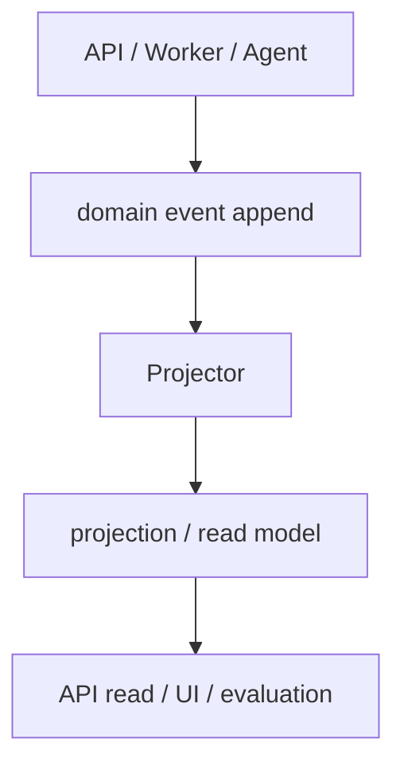

# DBライフサイクル

| table | lifecycle |
|---|---|
| `tenants` | tenant_events へのevent append後、projector がprojectionとして更新する。 |
| `users` | user_events へのevent append後、projector がprojectionとして更新する。 |
| `user_groups` | APIまたは管理操作で作成し、業務ルールに従って更新する。 |
| `user_group_memberships` | APIまたは管理操作で作成し、業務ルールに従って更新する。 |
| `web_sessions` | web_session_events へのevent append後、projector がprojectionとして更新する。 |
| `chat_sessions` | chat_session_events へのevent append後、projector がprojectionとして更新する。 |
| `chat_participants` | chat_participant_events へのevent append後、projector がprojectionとして更新する。 |
| `chat_messages` | APIまたは管理操作で作成し、業務ルールに従って更新する。 |
| `chat_runs` | chat_run_events へのevent append後、projector がprojectionとして更新する。 |
| `chat_message_events` | APIまたは管理操作で作成し、業務ルールに従って更新する。 |
| `citation_records` | APIまたは管理操作で作成し、業務ルールに従って更新する。 |
| `message_feedback` | APIまたは管理操作で作成し、業務ルールに従って更新する。 |
| `favorites` | APIまたは管理操作で作成し、業務ルールに従って更新する。 |
| `documents` | document_events へのevent append後、projector がprojectionとして更新する。 |
| `document_versions` | document_version_events へのevent append後、projector がprojectionとして更新する。 |
| `document_acl_entries` | document_acl_events へのevent append後、projector がprojectionとして更新する。 |
| `ingestion_jobs` | ingestion_job_events へのevent append後、worker がprojectionとして更新する。 |
| `reference_nodes` | APIまたは管理操作で作成し、業務ルールに従って更新する。 |
| `reference_edges` | APIまたは管理操作で作成し、業務ルールに従って更新する。 |
| `ws_tickets` | APIまたは管理操作で作成し、業務ルールに従って更新する。 |
| `user_import_jobs` | user_import_job_events へのevent append後、worker がprojectionとして更新する。 |
| `user_import_rows` | APIまたは管理操作で作成し、業務ルールに従って更新する。 |
| `evaluation_datasets` | APIまたは管理操作で作成し、業務ルールに従って更新する。 |
| `evaluation_cases` | APIまたは管理操作で作成し、業務ルールに従って更新する。 |
| `evaluation_runs` | evaluation_run_events へのevent append後、worker がprojectionとして更新する。 |
| `evaluation_run_items` | APIまたは管理操作で作成し、業務ルールに従って更新する。 |
| `llm_models` | APIまたは管理操作で作成し、業務ルールに従って更新する。 |
| `bm25_search_documents` | APIまたは管理操作で作成し、業務ルールに従って更新する。 |
| `bm25_postings` | APIまたは管理操作で作成し、業務ルールに従って更新する。 |
| `bm25_term_stats` | APIまたは管理操作で作成し、業務ルールに従って更新する。 |
| `bm25_field_stats` | APIまたは管理操作で作成し、業務ルールに従って更新する。 |
| `event_delivery_logs` | APIまたは管理操作で作成し、業務ルールに従って更新する。 |
| `audit_events` | append-onlyで作成し、更新・削除しない。 |
| `agent_tools` | APIまたは管理操作で作成し、業務ルールに従って更新する。 |
| `tool_invocations` | tool_invocation_events へのevent append後、agent がprojectionとして更新する。 |
| `published_artifacts` | published_artifact_events へのevent append後、ci がprojectionとして更新する。 |
| `test_report_runs` | test_report_run_events へのevent append後、ci がprojectionとして更新する。 |
| `schema_migrations` | migration適用時に作成し、履歴として保持する。 |
